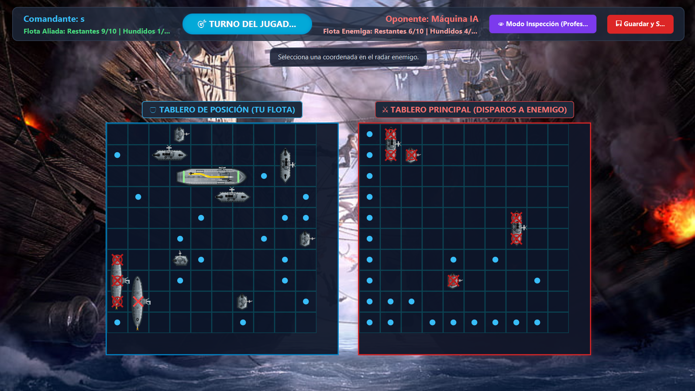

# 🎮 Battleship Game

A classic Naval Battle game implemented in Java featuring artificial intelligence, custom 2D graphics, and an interactive user interface.

---

## 👥 Authors

| Name | ID |
|------|-----|
| Leonardo Rosero | 2518313 |
| Alejandro Velez | 2521169 |
| Julio Cesar | 2517931 |
| Esteban Mina | 2518466 |

---

## 📋 Project Description

This project is an implementation of the classic Battleship game where you can face off against an intelligent AI opponent. The player and the AI place their ships on a board and take turns trying to sink each other's fleet.

---

## ✨ Key Features

### 🤖 Artificial Intelligence (AI)
- **Smart Firing System**: The AI strategically analyzes the board and adjusts its attack strategy
- **Adaptive Algorithm**: The enemy learns and optimizes its movements throughout the game
- **Strategic Targeting**: The machine calculates the best coordinates to maximize the probability of sinking ships
- **Dynamic Decision Making**: Real-time evaluation of board state for optimal play

### 🎨 2D Graphics with Shape
- **Custom 2D Figures**: All visual game elements are created using geometric shapes (Shape)
- **Animated Ships**: Visual representation of different ship types (Battleship, Cruisers, Destroyers, etc.)
- **Dynamic Board**: Interactive grid with visual indicators for shots, hits, and water
- **Enhanced Visual Interface**: Custom graphical elements for an immersive experience

### 🎯 Game Mechanics
- Strategic ship placement
- Turn-based alternating system
- Real-time visual feedback
- Status indicators: Ally Fleet vs Enemy Fleet
- Inspection Mode for position review (Professors)
- Coordinated targeting system

---

## 🖼️ Gameplay Screenshot



---

## 🎮 How to Play

1. **Ship Positioning**: Place your fleet on the initial board
2. **Player Turn**: Select a coordinate on the enemy radar to fire
3. **AI Turn**: The enemy calculates and executes its best move
4. **Objective**: Sink all enemy ships before they sink yours

---

## 🛠️ Technologies Used

- **Language**: Java
- **Graphics**: Java Swing with 2D shapes (Shape API)
- **Architecture**: Object-Oriented Programming (OOP)

---

## 📁 Project Structure

```
Miniproyecto-4-BattleShip/
├── src/
│   ├── game/
│   │   ├── BattleshipGame.java
│   │   ├── Board.java
│   │   ├── Ship.java
│   │   └── Player.java
│   ├── ai/
│   │   ├── AIPlayer.java
│   │   └── Strategy.java
│   ├── graphics/
│   │   ├── GamePanel.java
│   │   └── ShapeRenderer.java
│   └── Main.java
├── README.md
└── LICENSE
```

---

## 🚀 Requirements

- Java JDK 8 or higher
- Java development environment (Recommended IDE: IntelliJ IDEA, Eclipse, or NetBeans)

---

## 💻 Installation and Execution

1. Clone the repository:
```bash
git clone https://github.com/Leo0208r/Miniproyecto-4-BattleShip-larm-avb-jcun-jemm.git
```

2. Navigate to the project directory:
```bash
cd Miniproyecto-4-BattleShip-larm-avb-jcun-jemm
```

3. Compile the project:
```bash
javac -d bin src/**/*.java
```

4. Run the game:
```bash
java -cp bin Main
```

---

## 🎓 Key Learnings

- Implementation of AI algorithms for strategic decision-making
- Development of 2D graphical interfaces in Java
- Object-oriented programming and design patterns
- Game state and turn management
- Computational logic optimization
- Real-time graphics rendering with custom shapes

---

## 📝 License

This project was developed as part of a university programming course.

---

## 🤝 Contributions

This is an academic team project. For more information or suggestions, contact the authors.

---

**Enjoy playing Battleship!** ⚓🎯
